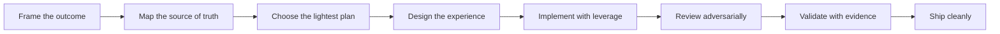

# Product Craft

> **A product-minded engineering skill for building interfaces people actually want to use.**

Product Craft helps AI coding agents move from vague product intent to a polished, tested, shippable result. It combines product framing, visual judgment, implementation discipline, QA, and release thinking in one portable workflow.

[](SKILL.md)
[](references/)
[](SKILL.md)

## Why Product Craft?

Most coding-agent instructions optimize for **shipping code**. Product Craft optimizes for shipping the **right experience**:

- clarify the outcome before touching implementation
- map the existing codebase before inventing new patterns
- design hierarchy, states, accessibility, and responsive behavior before decoration
- implement with reusable primitives and stable boundaries
- review like a user, designer, engineer, and maintainer
- validate with evidence instead of confident-sounding claims

## The workflow



## What it covers

| Area | Built-in judgment |
| --- | --- |
| Product thinking | Jobs-to-be-done, constraints, acceptance signals, scope control |
| UI/UX | Hierarchy, visual direction, responsive states, accessibility, anti-slop review |
| Web engineering | React, Next.js, TypeScript, composition, performance, resilient async flows |
| Mobile engineering | React Native, Expo, touch behavior, interruptions, offline and platform conventions |
| Quality | Debugging, regression prevention, evidence levels, failure-path review |
| Delivery | Release readiness, rollback thinking, documentation, post-release learning |

## Install

Copy this folder into the skills directory supported by your AI coding agent, then load `SKILL.md` as the entry point.

```bash
git clone https://github.com/dtvvgp-hue/product-craft.git
cd product-craft
```

The package is intentionally portable: it does not require vendor-specific credentials, a runtime dependency, or a particular framework.

## Use it when...

- a product request is underspecified and needs sharper framing
- a UI looks technically correct but generic or unfinished
- a feature touches multiple layers and needs a lightweight plan
- a redesign needs taste without breaking the information architecture
- a code change needs QA, accessibility, responsive, or release review

## Reference guides

The main skill stays fast to load. Pull in the guide that matches the work:

- [`ui-ux.md`](references/ui-ux.md): visual systems, interaction design, responsive behavior, motion, accessibility
- [`react-web.md`](references/react-web.md): React, Next.js, TypeScript, performance, browser behavior
- [`mobile.md`](references/mobile.md): React Native, Expo, touch, safe areas, interruptions
- [`quality-qa.md`](references/quality-qa.md): debugging, tests, review gates, evidence-based assurance
- [`agent-workflow.md`](references/agent-workflow.md): decomposition, handoffs, parallel work, integration
- [`shipping.md`](references/shipping.md): release readiness, deployment, rollback, follow-up

## Example prompt

> Build a responsive onboarding flow for a B2B analytics product. First inspect the existing patterns, then propose the smallest plan. Implement loading, empty, error, success, keyboard, and narrow-screen states. Finish with evidence of what you checked and what remains open.

## Design principles

**Clarity over ornament.** Use hierarchy and meaningful whitespace before effects.

**One strong idea over a pile of effects.** Avoid generic gradients, dashboard-card soup, fake metrics, and motion without purpose.

**Evidence over vibes.** Separate what was observed, checked, and assumed.

**Small and reversible beats clever and sprawling.** Preserve working behavior outside the requested scope.

## Benchmark

See the [competitor benchmark](BENCHMARK.md) for a capability comparison, adoption signals, gaps, and the recommended upgrade path.

## Validation

Run the included package check:

```bash
bash scripts/validate.sh
```

## Contributing

Useful contributions are specific: better decision rules, sharper examples, stronger accessibility guidance, or corrections grounded in real product work. Keep additions portable and avoid environment-specific instructions that only work in one codebase.

## License

No license has been selected yet. Add one before redistributing the package publicly.
